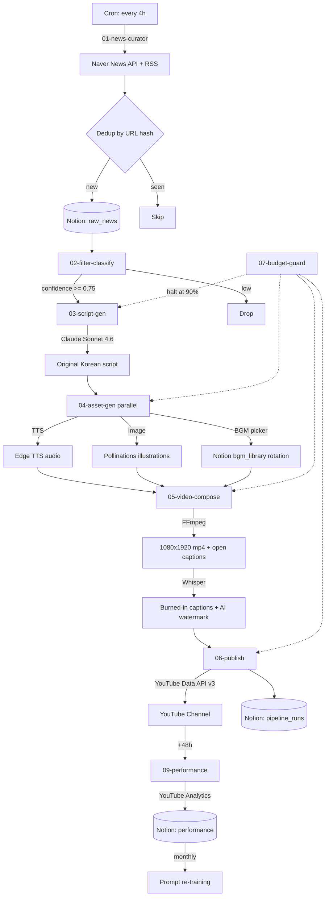
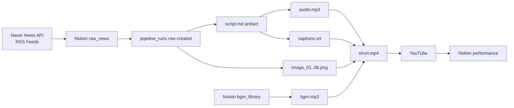
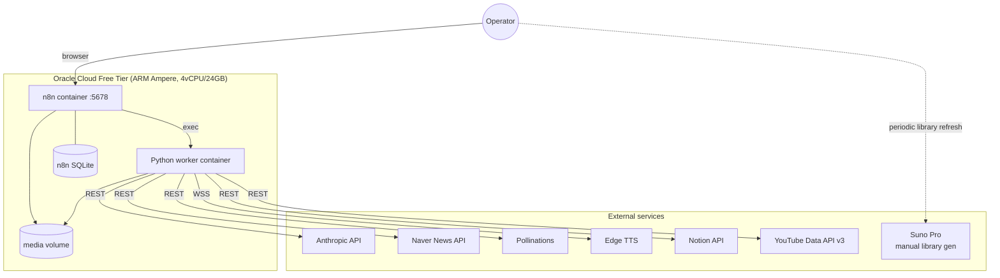

# Architecture — Trot Content Automation Factory

## Control flow



## Data flow



## Deployment topology



## Why this shape

1. **n8n as orchestration, Python as muscle**: n8n handles cron, retries, conditional branching, credential storage, and operator UI. Python scripts handle the actual API work because (a) FFmpeg/Whisper need a real process, (b) Anthropic SDK lives in Python, (c) keeping logic in code beats keeping it in dragged-and-dropped nodes.
2. **Single VPS, single channel**: per auto-decision D-2.1 and D-2.14. Multi-channel parallelism is deferred until Phase 1 economics prove out.
3. **Notion as the operator console**: per D-2.2. Gives the human a no-code view of every pipeline run, scripted approvals, and a budget dashboard without standing up a Grafana stack.
4. **Idempotency by URL hash**: dedup at ingestion + status state machine in `pipeline_runs` lets the pipeline crash and resume without producing duplicate uploads (SC-7).
5. **Disclosure baked into the composer, not the publisher**: the watermark is burned into the video frame so it survives re-uploads, scrapes, and re-encoding by third parties — important for the right-of-publicity defense.

## State machine — `pipeline_runs.status`

```
pending → script_done → assets_done → composed → uploaded
                                                      ↓
                                                  measured (+48h)
                                                      ↓
                                                  archived
```

Failure paths: any step → `failed` (with `failed_at_step` recorded). Operator runs `make resume RUN=<id>` to retry from the last successful step.
