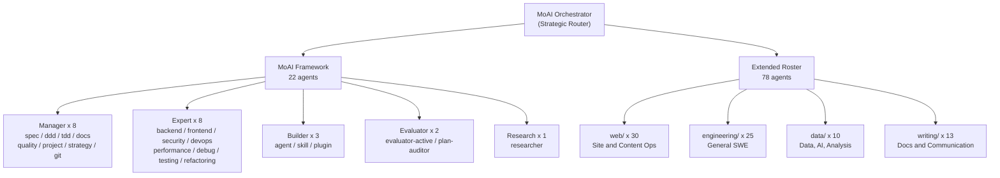

# Agent Architecture

The MoAI orchestrator routes work across a 100-agent roster organized into
five tiers. The MoAI framework owns 22 core agents under `.claude/agents/moai/`,
and the extended roster contributes 78 single-responsibility agents across
four tier directories (`web/`, `engineering/`, `data/`, `writing/`).

See [`.moai/plans/agent-roster-100.md`](../.moai/plans/agent-roster-100.md)
for the full blueprint and audit notes.

## High-level diagram



## Directory tree

```
.claude/agents/
├── moai/          22 -- Framework core
│   ├── manager-*       (8)  workflow orchestration
│   ├── expert-*        (8)  domain expertise
│   ├── builder-*       (3)  meta-creation (agent/skill/plugin)
│   ├── evaluator-*     (2)  independent assessment
│   └── researcher      (1)  self-research loop
│
├── web/           30 -- Static site and content operations
│   ├── SEO              seo-auditor, meta-tag-curator,
│   │                    structured-data-author, sitemap-manager,
│   │                    robots-curator, llms-txt-curator
│   ├── Quality          accessibility-auditor, lighthouse-optimizer,
│   │                    html-validator, css-linter, link-checker
│   ├── Assets           image-optimizer, font-optimizer,
│   │                    og-image-designer
│   ├── Content          content-writer, magazine-editor,
│   │                    blog-publisher, newsletter-composer,
│   │                    rss-feed-builder, copy-proofreader,
│   │                    i18n-translator
│   └── Platform         landing-builder, form-handler,
│                        redirect-manager, pwa-curator,
│                        darkmode-themer, vercel-deployer,
│                        analytics-integrator, changelog-writer,
│                        component-extractor
│
├── engineering/   25 -- General software engineering
│   ├── Review           code-reviewer, bug-triager,
│   │                    concurrency-auditor, license-compliance-checker
│   ├── Design           api-designer, db-schema-architect,
│   │                    cli-builder, error-handler-designer
│   ├── Testing          test-author, mock-data-generator,
│   │                    benchmark-runner
│   ├── Infra            ci-pipeline-builder, dockerfile-author,
│   │                    git-hook-author, shell-scripter,
│   │                    env-config-manager
│   ├── Code Quality     code-commenter, type-annotator,
│   │                    regex-crafter, codemod-author,
│   │                    config-schema-validator
│   └── Ops              dependency-auditor, log-analyzer,
│                        migration-writer, release-notes-writer
│
├── data/          10 -- Data, AI, analysis
│   ├── Pipeline         data-cleaner, csv-json-transformer,
│   │                    data-pipeline-designer, spreadsheet-analyst
│   ├── Modeling         json-schema-author, knowledge-graph-builder
│   ├── Visualization    data-visualizer, statistics-reporter
│   └── AI               prompt-engineer, llm-eval-designer
│
└── writing/       13 -- Documentation and communication
    ├── Technical        technical-writer, readme-author,
    │                    tutorial-writer, faq-builder,
    │                    glossary-curator
    ├── Business         proposal-writer, presentation-builder,
    │                    meeting-notes-taker, email-drafter
    └── Editorial        translator-ko-en, summarizer,
                         citation-formatter, style-guide-enforcer
```

## Delegation decision tree

```
User request
  |
  +-- Read-only codebase exploration?     -> Explore
  +-- External docs / API research?       -> WebSearch / Context7 MCP
  +-- Domain expertise needed?            -> expert-{domain}      [moai/]
  +-- Workflow coordination needed?       -> manager-{workflow}   [moai/]
  +-- Complex multi-step task?            -> manager-strategy
  +-- Website or content operation?       -> web/* agent
  +-- General SWE / data / writing task?  -> engineering/ data/ writing/
```

## Tier roles at a glance

| Tier            | Count | Path prefix              | Primary responsibility                       |
|-----------------|------:|--------------------------|----------------------------------------------|
| MoAI Framework  |    22 | `.claude/agents/moai/`   | Orchestration, expertise, meta-creation      |
| Web Operations  |    30 | `.claude/agents/web/`    | Static site, SEO, content, platform          |
| Engineering     |    25 | `.claude/agents/engineering/` | Reviews, design, testing, infra, ops    |
| Data and AI     |    10 | `.claude/agents/data/`   | Pipelines, modeling, visualization, prompts  |
| Writing         |    13 | `.claude/agents/writing/`| Technical docs, business comms, editorial    |

Each extended-roster agent declares explicit scope boundaries with
OUT-OF-SCOPE delegation routes, so the orchestrator can hand off cleanly
between specialists without overlap.
